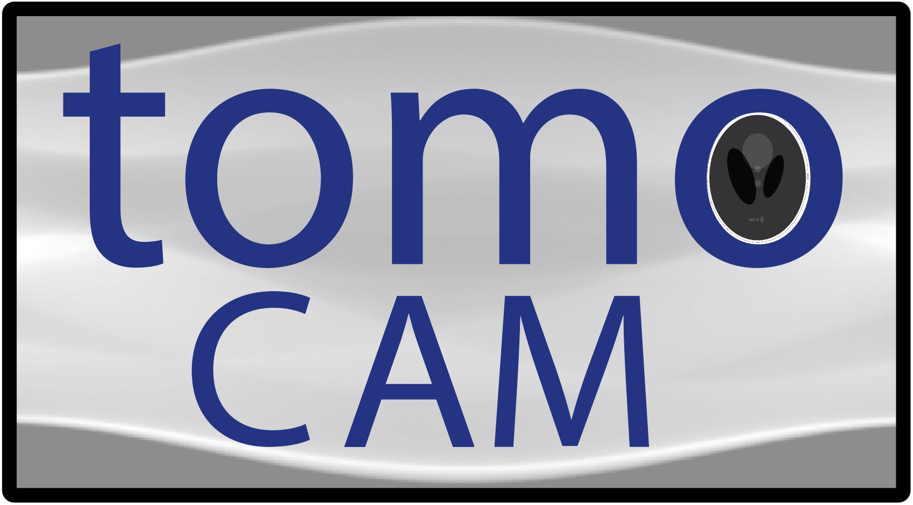

# tomoCAM

<p style="text-align: center;">

</p>


**tomoCAM** is a fast, GPU-accelerated **Model-Based Iterative Reconstruction (MBIR)** framework for synchrotron tomography data, utilizing **Non-Uniform Fast Fourier Transforms (NUFFT)** for advanced computational imaging applications.

---

## Table of Contents
- [Features](#features)
- [Requirements](#requirements)
- [Installation](#installation)
- [Usage](#usage)
- [Citation](#citation)
- [License](#license)
- [Disclaimer](#disclaimer)
- [Contact](#contact)
- [Contributing](#contributing)
- [Acknowledgements](#acknowledgements)

---

## Features
- High-speed MBIR reconstruction optimized for GPUs
- NUFFT for efficient data processing
- User-friendly Python interface
- Open-source with DOE-supported licensing
- Suitable for a variety of synchrotron imaging applications

---

## Requirements
Before you start, make sure your system meets these requirements:
- **CUDA** (NVIDIA GPU drivers and toolkit)
- **CMake** (version 3.10 or later recommended)
- **pybind11** (for Python bindings)
- **numpy** (for numerical operations)
- [**finufft**](https://finufft.readthedocs.io/en/latest/install.html)

---

## Installation

### Recommended (Using `virtualenv`)
1. Install virtualenv:
   ```bash
   pip install virtualenv
   ```

2. Create the virtual environment
   ```bash
   python3 -m venv tomcam-venv
   ```
3. Activate the virtual environment
    ```bash
    source tomocam-venv/bin/activate
    ```
### With or without virtualenv
4. Install tomocam
   ```bash
   pip install git+https://github.com/lbl-camera/tomocam.git
   ```
## Usage
   ```python
   import numpy as np
   from tomocam import recon
   import tomopy

   # Preprocss data using tomopy
   # data, flat, dark, theta
   read_projections( ... )
   # normalize
   tomo = tomopy.normalize( ... )
   # -log
   tomo = tomopy.minus_log( ... ) 
   # find center of rotation
   center = tomopy.find_center( ... )

   # call tomocam recon
   result = recon(sino, theta, center)
   ```


**Citation**
------------
If you use this code in your research, please cite the following paper:

Kumar, D., Parkinson, D. Y. and Donatelli, J. J. (2024). *tomoCAM: fast model-based iterative reconstruction via GPU acceleration and non-uniform fast Fourier transforms*. **J. Synchrotron Rad**. 31, 85-94. https://doi.org/10.1107/S1600577523008962


**Copyright Notice**
---------------------

Tomocam Copyright (c) 2018, The Regents of the University of California, through Lawrence Berkeley National Laboratory (subject to receipt of any required approvals from the U.S. Dept. of Energy).  All rights reserved.

 

If you have questions about your rights to use or distribute this software, please contact Berkeley Lab's Innovation & Partnerships Office at  IPO@lbl.gov.

 

NOTICE.  This Software was developed under funding from the U.S. Department of Energy and the U.S. Government consequently retains certain rights. As such, the U.S. Government has been granted for itself and others acting on its behalf a paid-up, nonexclusive, irrevocable, worldwide license in the Software to reproduce, distribute copies to the public, prepare derivative works, and perform publicly and display publicly, and to permit other to do so. 

 

**License Agreement**
---------------------

Tomocam Copyright (c) 2018, The Regents of the University of California, through Lawrence Berkeley National Laboratory (subject to receipt of any required approvals from the U.S. Dept. of Energy).  All rights reserved.

 

Redistribution and use in source and binary forms, with or without modification, are permitted provided that the following conditions are met:

 

(1) Redistributions of source code must retain the above copyright notice, this list of conditions and the following disclaimer.

 

(2) Redistributions in binary form must reproduce the above copyright notice, this list of conditions and the following disclaimer in the documentation and/or other materials provided with the distribution.

 

(3) Neither the name of the University of California, Lawrence Berkeley National Laboratory, U.S. Dept. of Energy nor the names of its contributors may be used to endorse or promote products derived from this software without specific prior written permission.

 

THIS SOFTWARE IS PROVIDED BY THE COPYRIGHT HOLDERS AND CONTRIBUTORS "AS IS" AND ANY EXPRESS OR IMPLIED WARRANTIES, INCLUDING, BUT NOT LIMITED TO, THE IMPLIED WARRANTIES OF MERCHANTABILITY AND FITNESS FOR A PARTICULAR PURPOSE ARE DISCLAIMED. IN NO EVENT SHALL THE COPYRIGHT OWNER OR CONTRIBUTORS BE LIABLE FOR ANY DIRECT, INDIRECT, INCIDENTAL, SPECIAL, EXEMPLARY, OR CONSEQUENTIAL DAMAGES (INCLUDING, BUT NOT LIMITED TO, PROCUREMENT OF SUBSTITUTE GOODS OR SERVICES; LOSS OF USE, DATA, OR PROFITS; OR BUSINESS INTERRUPTION) HOWEVER CAUSED AND ON ANY THEORY OF LIABILITY, WHETHER IN CONTRACT, STRICT LIABILITY, OR TORT (INCLUDING NEGLIGENCE OR OTHERWISE) ARISING IN ANY WAY OUT OF THE USE OF THIS SOFTWARE, EVEN IF ADVISED OF THE POSSIBILITY OF SUCH DAMAGE.

 

You are under no obligation whatsoever to provide any bug fixes, patches, or upgrades to the features, functionality or performance of the source code ("Enhancements") to anyone; however, if you choose to make your Enhancements available either publicly, or directly to Lawrence Berkeley National Laboratory, without imposing a separate written license agreement for such Enhancements, then you hereby grant the following license: a  non-exclusive, royalty-free perpetual license to install, use, modify, prepare derivative works, incorporate into other computer software, distribute, and sublicense such enhancements or derivative works thereof, in binary and source code form.
